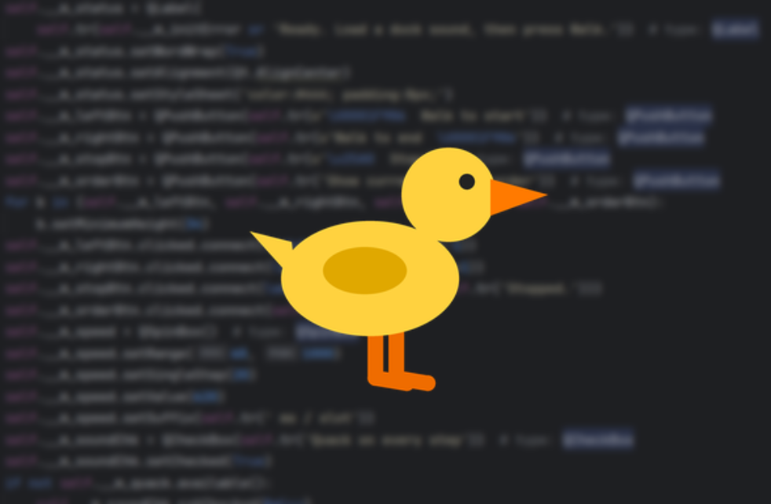

# 🦆 TheWalkingDuckTaskBar

**A walking duck that waddles your window across the real Windows taskbar - quacking on every step.**

TheWalkingDuckTaskBar is a playful PyQt desktop toy that physically reorders your window's taskbar button, one slot at a time, using the [7+ Taskbar Tweaking Library (TTLib)](https://ramensoftware.com/7-taskbar-tweaking-library). While the button "walks" left or right across the taskbar, the window icon plays an animated cartoon duck walk cycle (drawn entirely with Qt - no image assets needed), and a real audio file of your choice quacks on every slot it steps across.

## 🎬 Demo:

[](https://youtu.be/FGZwDOqFLUc)

▶️ *Click the image to watch the duck waddle across the taskbar on YouTube.*

---

## ✨ Features:

- **Real taskbar manipulation** - moves the window's taskbar button group one slot at a time (left or right) via a thin `ctypes` wrapper around TTLib.
- **Animated duck icon** - a 4-frame walk cycle, with left/right facing variants and an idle pose, rendered procedurally with `QPainter` (no external images).
- **Real quack sounds** - plays any audio file on every step:
    - `.wav` → a round-robin pool of `QSoundEffect` instances, so rapid consecutive quacks overlap instead of cutting each other off.
    - `.mp3`, `.ogg`, `.m4a`, `.wma`, `.aac`, … → `QMediaPlayer` using the platform codecs.
- **Adjustable step speed** - from 60 ms to 1000 ms per taskbar slot.
- **Taskbar inspector** - a "Show current taskbar order" button lists every button group (AppId + type: normal / pinned / combined / temporary) from left to right.
- **Edge detection** - the duck stops automatically (and tells you) when it reaches the left or right edge of the taskbar.

## 📋 Requirements:

| Requirement     | Details                                                                                                                                                                                                                                           |
|-----------------|---------------------------------------------------------------------------------------------------------------------------------------------------------------------------------------------------------------------------------------------------|
| **OS**          | Windows 10, **build ≤ 19041** (May 2020 Update). TTLib 5.9 does **not** support newer Win10 builds or Windows 11 - it errors and may crash `explorer.exe`. For Windows 11, use the Windhawk *"Taskbar reorder within/between groups"* mod instead. |
| **Python**      | **64-bit** Python (must match the bitness of `explorer.exe`).                                                                                                                                                                                     |
| **TTLib**       | `TTLib64.dll` placed **next to the scripts**. Download [TTLib.zip](https://ramensoftware.com/downloads/TTLib.zip) (free for non-commercial use).                                                                   |
| **Qt bindings** | `pip install PyQt5` (QtMultimedia ships with it). The code imports through the `ManyQt` compatibility layer.                                                                                                                                      |

## 🚀 Installation:

```bash
# 1. Clone the project
git clone https://github.com/<you>/TheWalkingDuckTaskBar.git
cd TheWalkingDuckTaskBar
# 2. Install dependencies (64-bit Python!)
pip install PyQt5
# 3. Download TTLib.zip from ramensoftware.com and copy
#    TTLib64.dll into the project folder, next to main.py
```

## 🎮 Usage:

Run the app:

```bash
python main.py
```

Optionally pass a sound file on the command line:

```bash
python main.py C:\sounds\quack.mp3
```

### Providing the duck sound:

The quack can be supplied in any of three ways (checked in this order):

1. **CLI argument** - `python main.py path\to\sound.mp3`
2. **Auto-load** - put a file named `quack.mp3` next to the scripts.
3. **In-app** - click **"Choose duck sound…"** and pick any supported audio file (a quick preview plays on load).

### Controls:

| Control                        | Action                                                      |
|--------------------------------|-------------------------------------------------------------|
| 🦆 **Walk to start**           | Waddle the taskbar button leftward, one slot at a time.     |
| **Walk to end** 🦆             | Waddle the taskbar button rightward.                        |
| ■ **Stop**                     | Halt the walk immediately.                                  |
| **Step speed**                 | Milliseconds per taskbar slot (60–1000 ms, default 620).    |
| **Quack on every step**        | Toggle the sound effect.                                    |
| **Show current taskbar order** | List all taskbar button groups with their AppIds and types. |

## 📁 Project Structure:

```
TheWalkingDuckTaskBar/
├── __init__.py       # Package exports (QuackPlayer, TaskbarMover, makeDuckIcon, …)
├── main.py           # Entry point: sets the AppUserModelID and launches the window
├── mainwindow.py     # MainWindow: UI, walk/animation timers, sound + speed options
├── walkingduck.py    # Core: QuackPlayer, duck-icon painter, TTLib ctypes wrapper
├── TTLib64.dll       # (you supply this) 7+ Taskbar Tweaking Library
└── quack.mp3         # (optional) auto-loaded default duck sound
```

### Module overview:

- **`walkingduck.py`**
  - `QuackPlayer` - loads and plays the audio file; WAV files get a pool of `QSoundEffect`s played round-robin for overlapping low-latency quacks, other formats go through `QMediaPlayer`.
  - `makeDuckIcon(phase, facingRight, idle, size)` - paints a cartoon duck `QIcon` for any of the 4 walk-cycle frames, in either direction, plus an idle pose.
  - `TaskbarMover` - `ctypes` wrapper over TTLib (`TTLib_Init`, `TTLib_LoadIntoExplorer`, `TTLib_ButtonGroupMove`, …). `step(hwnd, direction)` moves the group owning the window by exactly one slot and reports `(old, new)` positions; `listOrder()` enumerates all groups.
  - `TTLibError` - raised for any TTLib failure (missing DLL, unsupported Windows build, load failure, …).
- **`mainwindow.py`** - the GUI: two timers (one for taskbar steps at the chosen speed, one at 110 ms for icon animation), status messages, sound chooser, and graceful cleanup (unloads TTLib from `explorer.exe` on close).
- **`main.py`** - sets an explicit `AppUserModelID` so the app gets its own taskbar button, then starts the Qt event loop.

## ⚠️ Troubleshooting:

- **"TTLib64.dll not found next to this script"** - download TTLib.zip from ramensoftware.com and copy the DLL into the project folder.
- **"TTLib_LoadIntoExplorer failed"** - your Windows build is likely newer than TTLib 5.9 supports (Win10 build > 19041 / Windows 11), or the app needs to run elevated.
- **"Quack (QtMultimedia unavailable)"** - the QtMultimedia module could not be imported; reinstall PyQt5.
- **"This window's taskbar button wasn't found"** - make sure the window is visible and actually shows on the taskbar (not minimized to tray).
- **No sound plays** - check that a sound file is loaded (the label under the buttons shows the current file) and the "Quack on every step" box is checked.

## ⚖️ Notes & Credits:

- Taskbar manipulation is powered by the **7+ Taskbar Tweaking Library** by [Ramen Software](https://ramensoftware.com/7-taskbar-tweaking-library), which is free for **non-commercial** use - check its license before redistributing.
- This project injects into `explorer.exe` via TTLib; use it only on supported Windows builds to avoid crashing the shell.
- The duck artwork is drawn at runtime with pure Qt painting - feel free to restyle the duck by tweaking the `BODY`, `BEAK`, `LEG`, `WING`, and `EYE` colors in `walkingduck.py`.

---

*Waddle responsibly.* 🦆
